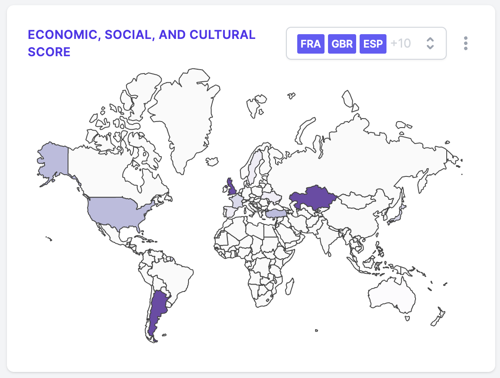

# Specification: Economic, Social, and Cultural Score

How do different countries rate on PISA's ultimate metric: the combined Economic, Social, and Cultural Score?

Here's the sort of thing we're aiming for:



## Data structure

This chart expects the following sort of data structure:

```json
{
  "dataset": [
    // one of the below object for each country
    {
      "id": "A three-letter country code, uppercased. e.g. GBR",
      "value": "The country's ESCS score, usually between -5.0 and 5.0."
    }
  ]
}
```

## Statistical analysis

This chart is made up by combining three computed indices: the estimated number of years of parental schooling (`PARED`), the highest occupation of a parent (`HISEI`), and an index of wealth based on home posessions (`HOMEPOS`).

To construct them, and then combine them, consult the [PISA 2018 Annex A1](https://www.oecd-ilibrary.org/sites/84a683c1-en/index.html?itemId=/content/component/84a683c1-en#sect-106).
