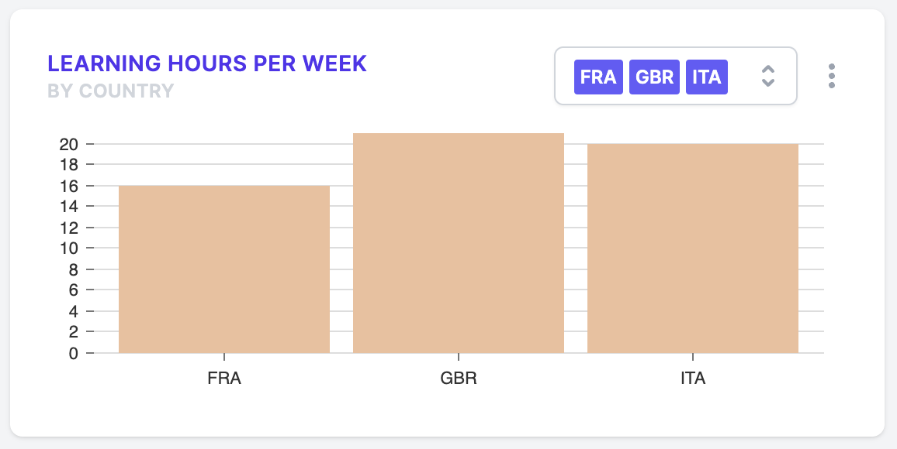

# Specification: Learning Hours per Week

How much learning do students from different countries do?

Here's the sort of thing we're aiming for:



## Data structure

This chart expects the following sort of data structure:

```json
{
  "dataset": [
    // one of the below object for each country
    {
      "country": "A three-letter country code, uppercased. e.g. GBR",
      "hours": "The average TMINS for this country, as an integer, e.g. 1640"
    }
  ]
}
```

## Statistical analysis

This chart is made up of a computed index, the total minutes learning per week (`TMINS`), converted to hours, and averaged across a country.

To construct `TMINS`, consult the [PISA 2018 Annex A1](https://www.oecd-ilibrary.org/sites/84a683c1-en/index.html?itemId=/content/component/84a683c1-en#sect-106).
