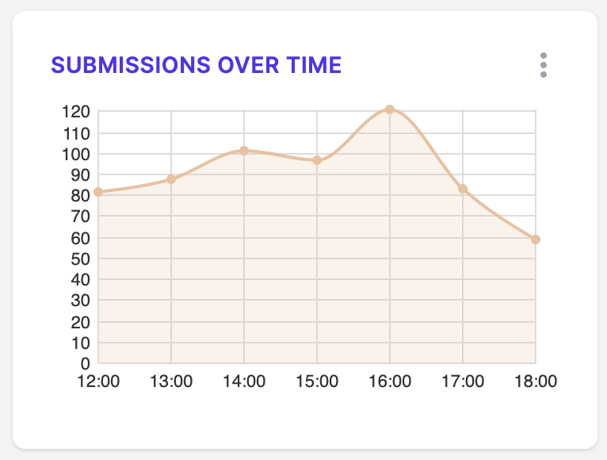

# Specification: Submissions over Time

Are there periods of greater or lower activity in the submissions we're receiving? This time series will help us find out.

Here's the sort of thing we're aiming for:



## Data structure

This chart expects the following sort of data structure:

```json
{
  "datasets": [
    {
      "id": "Submissions",
      "data": [
        { "x": "12:00", "y": 82 },
        { "x": "13:00", "y": 88 },
        { "x": "14:00", "y": 101 },
        { "x": "15:00", "y": 97 },
        { "x": "16:00", "y": 121 },
        { "x": "17:00", "y": 83 },
        { "x": "18:00", "y": 59 }
      ]
    }
  ]
}
```

## Statistical analysis

No major statistical analysis is required to get to this metric, although it might involve some tricky data manipulation.
